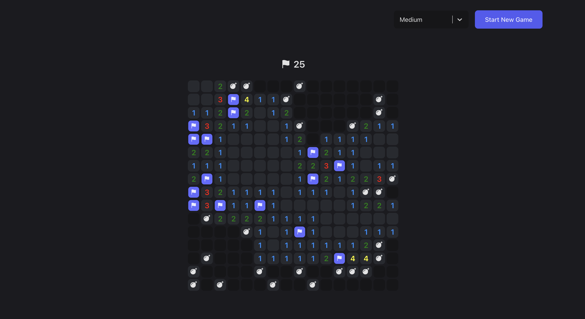

# Minesweeper

## General Functionality

Minesweeper is a classic puzzle game where the objective is to clear a grid of hidden mines without detonating any of them. Players can left-click on squares to reveal either a number (indicating how many adjacent squares contain mines) or a mine itself. The game allows players to flag suspected mines with a right-click. The goal is to uncover all safe squares while avoiding mines, providing an engaging challenge for players of all ages.

There are 3 difficulties to choose from:

- Easy (9x9 grid, 10 mines)
- Medium (16x16 grid, 40 mines)
- Hard (16x30 grid, 99 mines)

The game will generate a random grid of mines and numbers based on the difficulty selected.

## Game Rules

- Left-click on a square to reveal its contents.
- Right-click on a square to flag or unflag it.
- You win when all mines are flagged or all safe squares are revealed.
- You lose when you reveal a mine.

## Technologies Used

- React
- TypeScript
- Django REST Framework

## Project Structure

- `minesweeper/` - The main project directory
- `backend/` - The Django backend
- `frontend/` - The React frontend

### Backend

The backend is a Django REST Framework application that serves the frontend and handles game logic. It is responsible for generating the game board, handling user input, and determining the game's outcome.

### Unit Tests

Unit tests have been written for the backend to test the game logic. Simply run `python manage.py test` to run the tests once you have activated the virtual environment.

### Frontend

The frontend is a React application that provides the user interface for the game. A call to the backend is made to get the game board and to handle user input. Nothing is stored in the frontend to avoid the user from cheating.

## Setup

- Clone the repository
- In your terminal, run `cd minesweeper`
- Run `python -m venv .venv` to create a virtual environment in the minesweeper directory
- Run `source .venv/bin/activate` to activate the virtual environment

### Backend

- Run `cd backend`
- Run `pip install -r requirements.txt` to install the dependencies for the backend
- Run `python manage.py migrate` to create the database tables
- Run `python manage.py runserver` to start the development server

### Frontend

- Run `cd frontend`
- Run `yarn install` to install the dependencies for the frontend
- Run `yarn dev` to start the development server
- Open [http://localhost:3000](http://localhost:3000) in your browser to play the game
